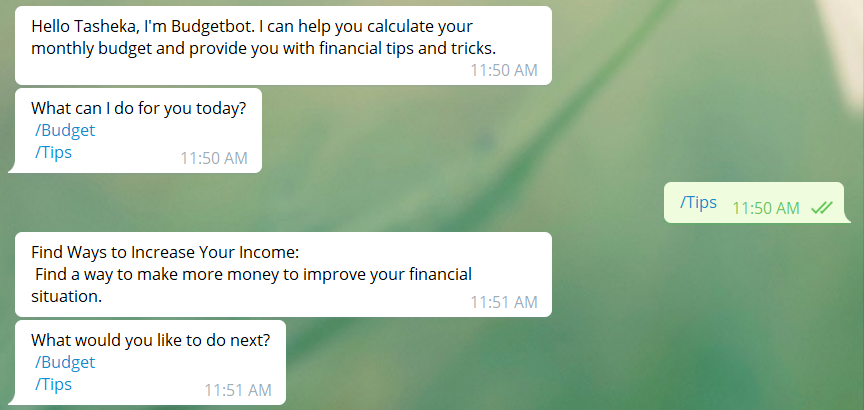

# Project Name
Ruby Capstone: Telegram Bot - Budgetbot

This project is a bot created  usinng telegram that takes a users incomes and expenses, and calculates the total income, total expenses and the remaining amount the user will have once he/she has paid his//her expenses. The bot also gives random financial tips and tricks when requested.

## Built With

- Ruby
- Rspec
- Telegram's BotFather

## Live Demo

[Live Demo Link]()

## Getting Started

To run this bot locally, you will need to have:

- A Telegram account
- Ruby installed
- Rspec installed
- Gems installed
- A terminal

Once you have all the above listed:

- Create a clone of this repository. 
  - In your terminal type 'git clone https://github.com/Tasheka/Telegram_Bot-Budgetbot.git'
  - From your terminal move into the cloned repository folder by using the 'cd' command
- In your terminal, type 'bundle install' to  install the required gems 
- From your terminal move into the bin folder by using the 'cd' command
- Run the bot.rb file by typing 'bot.rb' inn your terminal.
- Search Budgetbot in Telegram
- Select the 'start' button to begin or type '/start' to begin

To test this bot using Rspec:

- In your terminal, from the root folder, type 'rspec'

## Financial Tips and Tricks Origin

The tip annd tricks quotes were taken from the following websites: https://www.thebalance.com/top-ten-financial-tips-1289309 and https://www.oberlo.com/blog/personal-finance-tips

## Authors

👤 Tasheka Hamilton

- GitHub: [@Tasheka](https://github.com/Tasheka)
- LinkedIn: [LinkedIn](https://www.linkedin.com/in/tasheka-hamilton-43532311b/)

## 🤝 Contributing

Contributions, issues, and feature requests are welcome!

Feel free to check the [issues page](https://github.com/Tasheka/Telegram_Bot-Budgetbot/issues).

## Show your support

Give a ⭐️ if you like this project!

## 📝 License

This project is [MIT](lic.url) licensed.
