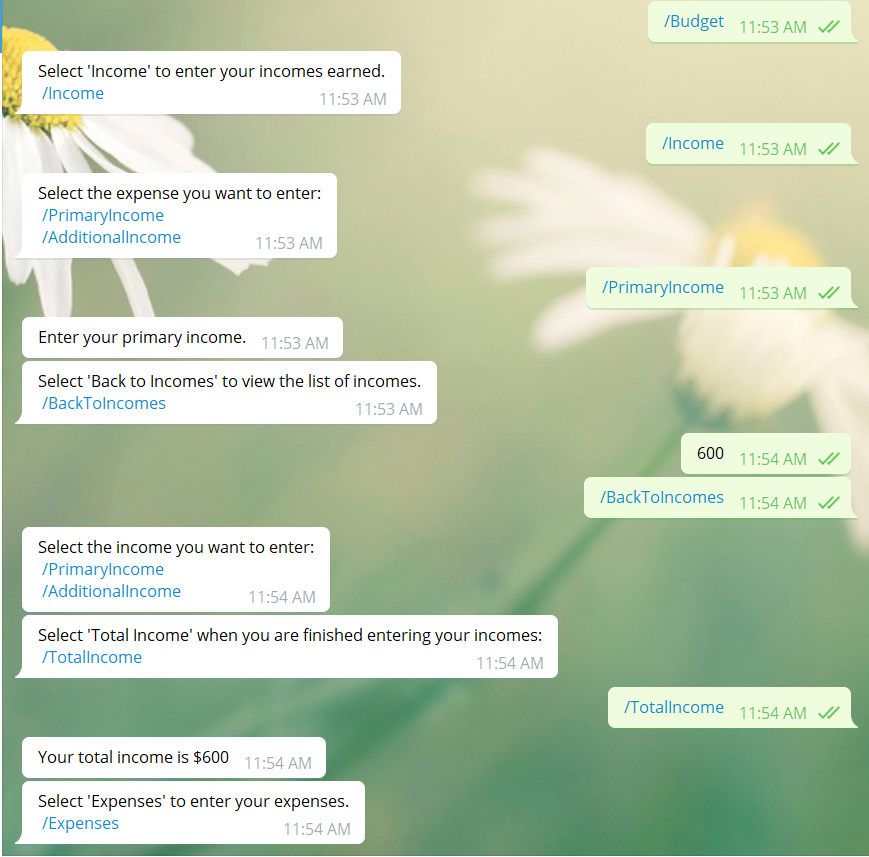

# Project Name
Ruby Capstone: Telegram Bot - Budgetbot

This project is a bot created  usinng telegram that takes a users incomes and expenses, and calculates the total income, total expenses and the remaining amount the user will have once he/she has paid his//her expenses. The bot also gives random financial tips and tricks when requested.

## Built With

- Ruby
- Rspec
- Telegram's BotFather

## Live Demo

[Live Demo Link]()

## Financial Tips and Tricks Origin

The tip annd tricks quotes were taken from the following websites: https://www.thebalance.com/top-ten-financial-tips-1289309 and https://www.oberlo.com/blog/personal-finance-tips

## Authors

👤 Tasheka Hamilton

- GitHub: [@Tasheka](https://github.com/Tasheka)
- LinkedIn: [LinkedIn](https://www.linkedin.com/in/tasheka-hamilton-43532311b/)

## 🤝 Contributing

Contributions, issues, and feature requests are welcome!

Feel free to check the [issues page](https://github.com/Tasheka/Telegram_Bot-Budgetbot/issues).

## Show your support

Give a ⭐️ if you like this project!

## 📝 License

This project is [MIT](lic.url) licensed.
